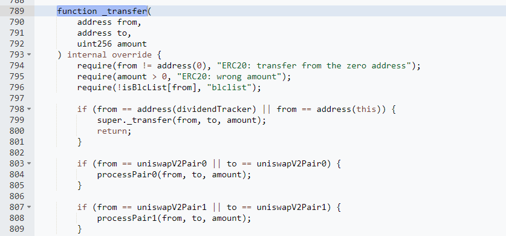

 ## GSS Token Exploit (BSC), 24 August 2023  - oversight in _transfer() function which can be abused by using skim()

 ### Summary 

 - The attacker flashloan 30,000 BUSDT from DODOOracle and swapped everything to GSS tokens using the BUSDT-GSS Pair on Pancakeswap. The attacker obtained 725,246 GSS tokens.
 - The attacker transferred 1 wei of GSS token to the 0x01 precompile address and 707,162 GSS tokens directly to the Pair address
 - The attacker calls skim with another Pair address (GSS-LP) as the input and sync. **The issue lies in the GSS `_transfer()` function**. `_transfer()` takes in 3 parameters: from, to, and amount. If the from or the to address is either the BUSDT-GSS pair or the GSS-LP pair, transfer the token.
 - Because `from` is the BUSDT-GSS address and `to` is the GSS-LP address, **707,162 tokens is withdrawn twice** from the original pool when calling skim.  
 - The attacker calls sync, and then call skim() on the other Pair address with the attack contract as the input address 
 - The attacker converts all his GSS tokens back to BUSDT tokens, netting him 24883 BUSDT tokens after repaying the flashloan
 - Total loss: **24,883 BUSDT**
 

 ### Test command

 > forge test --contracts ./bsc/test/gss/gss.t.sol -vv

 Test should pass and console should show this:

 ### Proof of Concept

 [gss.t.sol](https://github.com/cryptostaker2/blockchain-past-exploits/blob/main/bsc/test/gss/gss.t.sol)

 ### Transaction References

 1. [Phalcon Explorer](https://explorer.phalcon.xyz/tx/bsc/0x4f8cb9efb3cc9930bd38af5f5d34d15ce683111599a80df7ae50b003e746e336)

### In-depth Explanation

- At the start when the attacker swapped 30,000 BUSDT to GSS, the GSS Pool Balance decreased by 763,417. The attacker only received 725,246 tokens due to fees associated in the trade 
- There are two kinds of LP Pool. The [BUSDT-GSS Pool](https://bscscan.com/address/0x1ad2cb3c2606e6d5e45c339d10f81600bdbf75c0) and the [GSS-CAKELP Pool](https://bscscan.com/address/0xb4f4cd1cc2dff1a14c4aaa9e9434a92082855c64) 

The following shows the changes in the tokens in the pool after every instance:

##### BUSDT-GSS Liquidity Pool Before 30,000 BUSDT swap 
- Pair Balance of GSS at start: 1,470,579 | 772,541,070,055,015,370
- Pair Balance of BUSDT at start: 27,719 | 872,241,221,986,053,657

##### BUSDT-GSS Liquidity Pool After 30,000 BUSDT swap  
- Pair Balance of GSS after swap: 707,162 | 351,662,098,288,993,428
- Pair Balance of BUSDT after swap: 57,719 | 872,241,221,986,053,657

##### BUSDT-GSS Liquidity Pool After 700,000 transfer directly into the pool  
- Pair Balance of GSS before skim 1,379,966 | 208,256,846,499,101,644
- Pair Balance of BUSDT before skim 57,665 | 670,227,026,483,727,828

##### BUSDT-GSS Liquidity Pool After 700,000 transfer directly into the pool (THE ISSUE)
- Pair Balance of GSS after skim 36,357 | 740,098,859,750,014,128
- Pair Balance of BUSDT after skim 57,665 | 670,227,026,483,727,828

The underlying issue: 

processPair0: [BUSDT-GSS Pool](https://bscscan.com/address/0x1ad2cb3c2606e6d5e45c339d10f81600bdbf75c0)
processPair1: [GSS-CAKELP Pool](https://bscscan.com/address/0xb4f4cd1cc2dff1a14c4aaa9e9434a92082855c64)

Additional Information

- There's no reason to transfer 1 wei of tokens to the precompile contract
- The attacker could have earned $100 more if he added an additional 10,000 GSS tokens when calling. 

### Difficulty Level

- Complexity of Attack: Medium
- Level of Understanding Required: Medium

To understand the attack, you need to know what skim() and sync() is and how a callback function works. 
